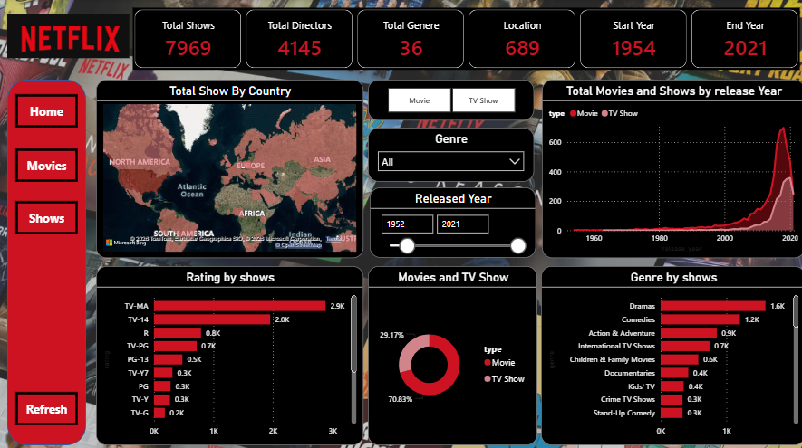

# 🎬 Netflix Content Analysis Dashboard

📌 Project Overview

This interactive Power BI Dashboard analyzes Netflix's complete content library, providing insights into Movies and TV Shows available on the platform from 1954 to 2021.

📊 Key Metrics

MetricValue
🎬 Total Shows      7,969
🎭 Total Directors  4,145
🎪 Total Genres     36
🌍 Total Locations  689 
📅 Start Year       1954
📅 End Year         2021

🔍 Dashboard Features

1. 🗺️ Total Shows by Country (Map Visual)

World map showing Netflix content distribution across countries
Darker regions indicate higher content availability

2. 📈 Total Movies & Shows by Release Year (Line Chart)

Trend analysis from 1952 to 2021
Separate lines for Movies and TV Shows
Shows massive growth after 2000s

3. ⭐ Rating by Shows (Bar Chart)

Content breakdown by age ratings
TV-MA has highest content (2.9K)
Followed by TV-14 (2.0K)

4. 🍩 Movies and TV Show Split (Donut Chart)

70.83% TV Shows
29.17% Movies

5. 🎭 Genre by Shows (Bar Chart)

Dramas most popular (1.6K)
Comedies second (1.2K)
Followed by Action & Adventure, International TV Shows

6. 🎛️ Interactive Filters

Toggle between Movie and TV Show
Filter by Genre (All genres available)
Released Year Slider — 1952 to 2021

🛠️ Tools Used

ToolPurposePower BI DesktopDashboard creation & visualizationMicrosoft Bing MapsGeographic map visualCSV DatasetRaw Netflix dataDAXCalculated measures & KPIs

📁 Project Structure

Netflix-Dashboard/
│
├── 📊 Netflix_Dashboard.pbix       # Power BI Dashboard file
├── 📄 Netflix_Data.csv             # Raw dataset
├── 🖼️ dashboard_screenshot.png     # Dashboard preview image
└── 📝 README.md                    # Project documentation

📂 Dataset Information

Source: Netflix Movies and TV Shows Dataset
Records: 7,969+ titles
Time Period: 1954 — 2021
Fields: Title, Director, Genre, Country, Release Year, Rating, Type

💡 Key Insights

📌 Netflix content grew exponentially after 2010
📌 TV Shows dominate at 70.83% of total content
📌 Dramas and Comedies are the most produced genres
📌 Content is available across 689 different locations
📌 TV-MA rated content is highest — targeting adult audience

🚀 How to Use
Download the .pbix file
Open in Power BI Desktop
Use Genre dropdown to filter specific genres
Use Year slider to select time range
Click Movie / TV Show toggle to switch views
Click Refresh button to reset all filters

👩‍💻 Author

Nandani

🔗 GitHub: @nandani2201
💼 Aspiring Data Analyst 

⭐ If you like this project, give it a star!
⭐ If you like this project, give it a star!
